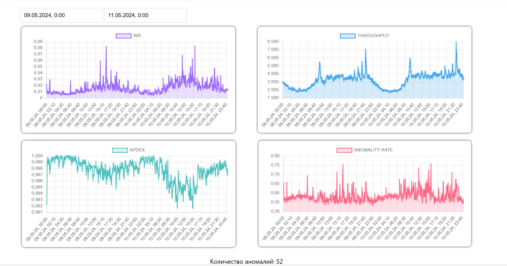

# Metrics Guard
### Сервис, позволяющий обнаруживать аномалии на участках метрик с помощью ИИ.

Запросы по API имеют вид `/api/{path}`.

### Запросы с полями start_time, end_time

1. `/api/web-response-time/` - Получение времени ответа веб-сервера. Передается диапазон времени для фильтрации.
2. `/api/throughput/` - Получение пропускной способности. Принимает временные параметры для фильтрации.
3. `/api/apdex/` - Получение показателя APDEX. Принимает временные параметры для фильтрации.
4. `/api/error-rate/` - Получение уровня ошибок. Принимает временные параметры для фильтрации.
5. `/api/time-sector/` - Получение временных секторов. Не требует временных параметров.
6. `/api/anomaly-stats/` - Получение статистики аномалий. Может использовать диапазон времени для анализа.
7. `/api/all-metrics/` - Получение всех метрик. Принимает временные параметры для фильтрации.
8. `/api/fdwa/` - Получение полных данных с аномалиями. Принимает временные параметры для фильтрации.
9. `/api/enchanced_wr/` - Получение улучшенных данных о времени ответа веб-сервера. Принимает временные параметры для фильтрации.
10. `/api/enchanced_thq/` - Получение улучшенной пропускной способности. Принимает временные параметры для фильтрации.
11. `/api/enchanced_apdex/` - Получение улучшенного показателя APDEX. Принимает временные параметры для фильтрации.
12. `/api/enchanced_all/` - Получение всех улучшенных данных. Принимает временные параметры для фильтрации.
13. `/api/enchanced_fwda/` - Получение улучшенного аномального показателя. Принимает временные параметры для фильтрации.

Каждый из этих запросов возвращает данные в формате JSON. Временные параметры могут использоваться для фильтрации данных по заданному диапазону времени.
